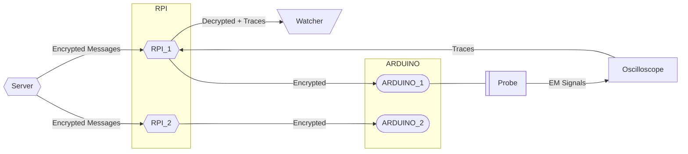

# defconsg-2026-nice-lab

### System Architecture Overview

This setup consists of a central server, two Raspberry Pi devices, and two Arduino boards used for encrypted communication and side-channel analysis.

#### Components

* **Server**

  * Sends encrypted messages wirelessly to both Raspberry Pi devices.

* **Raspberry Pi Nodes**

  * **RPI_1**

    * Receives encrypted messages from the server.
    * Forwards messages to ARDUINO_1.
    * Collects side-channel traces from the oscilloscope.
    * Sends decrypted messages and traces to the Watcher.
  * **RPI_2**

    * Receives encrypted messages from the server.
    * Forwards messages to ARDUINO_2.

* **Arduino Boards**

  * **ARDUINO_1**

    * Performs decryption of received messages.
    * Its activity is monitored for side-channel leakage.
  * **ARDUINO_2**

    * Performs decryption of received messages (no side-channel role).

* **Side-Channel Measurement Setup**

  * **EM Probe**

    * Captures electromagnetic (EM) emissions from ARDUINO_1.
  * **Oscilloscope**

    * Records EM traces during decryption.
    * Sends captured traces to RPI_1.

* **Watcher (Participant)**
  * Runs a provided script to receive:

    * Decrypted messages
    * Side-channel traces

#### Workflow

1. The Server sends encrypted messages wirelessly to both RPI_1 and RPI_2.
2. Each Raspberry Pi forwards the messages to its connected Arduino.
3. The Arduino boards perform decryption.
4. ARDUINO_1 operates as the Device Under Test (DUT), leaking EM signals during decryption.
5. The EM probe and oscilloscope capture these signals as traces.
6. RPI_1 collects both:

   * Decrypted messages
   * Side-channel traces
7. The Watcher retrieves this data by running a script.




### Setup
- run `setup_env_windows.bat` (Windows) or `setup_env_ubuntu.sh` (Ubuntu) to install dependencies
- run `run_watcher_windows.bat` (Windows) or `run_watcher_ubuntu.sh` (Ubuntu) to run the watcher script.

### Install from GitHub to run def_con.ipynb
```bash
pip install jupyterlab
pip install git+https://github.com/async2secure/scapyter.git
jupyter lab
```
